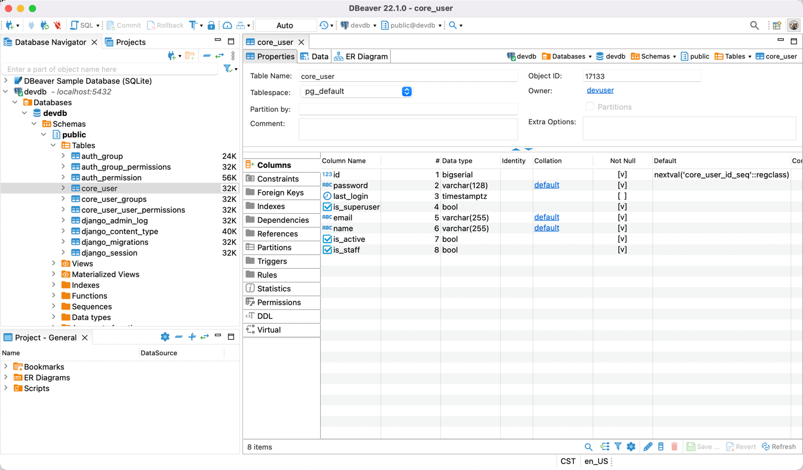
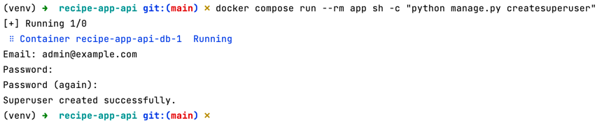
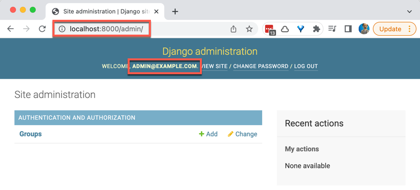

# Recipe App API

Source code for our course: Build a [Backend REST API with Python & Django - Advanced](http://londonapp.dev/django-python-advanced).

The course teaches how to build a fully functioning REST API using:

- Python
- Django / Django-REST-Framework
- Docker / Docker-Compose
- Test Driven Development

## Getting started

To start project, run:

```bash
docker-compose up
```

The API will then be available at [http://127.0.0.1:8000](http://127.0.0.1:8000).

## Notes

Generate a django application called `core`:

```bash
docker compose run --rm app sh -c "python manage.py startapp core"
```

Run tests *locally*:

```bash
python manage.py test
```

Run linter:

```bash
docker compose run --rm app sh -c "flake8"
```

Run tests:

```bash
docker compose run --rm app sh -c "python manage.py test"
```

Run single test:

```bash
docker compose run --rm app sh -c "python manage.py wait_for_db"
```

Run tests and linter:

```bash
docker compose run --rm app sh -c "python manage.py test && flake8"
```

Make database migrations:

```bash
docker compose run --rm app sh -c "python manage.py makemigrations"
```

Run database migrations:

```bash
docker compose run --rm app sh -c "python manage.py wait_for_db && python manage.py migrate"
```

Create superuser:

```bash
docker compose run --rm app sh -c "python manage.py createsuperuser"
```

Django admin site:

```bash
http://localhost:8000/admin/
```

## Screenshots

core_user:


create_superuser:


admin_site:

